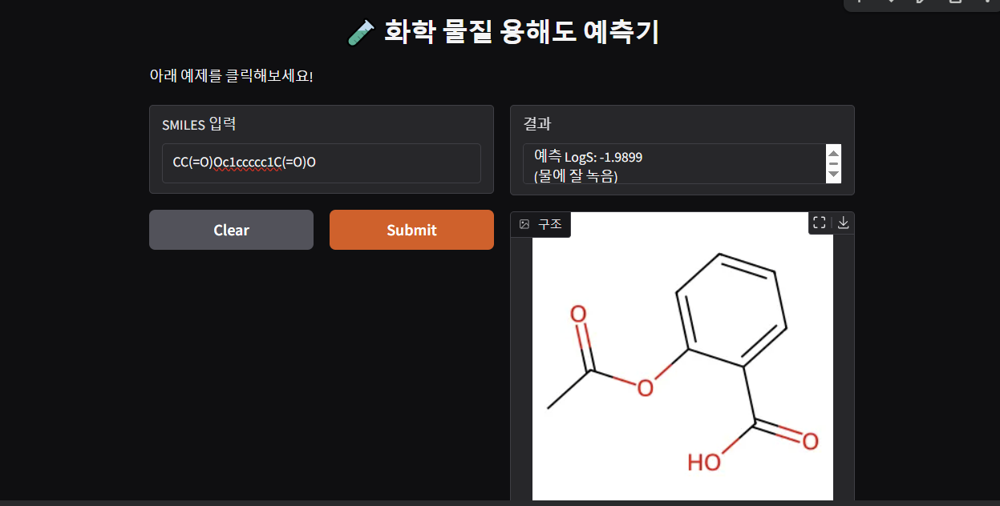

# 🧪 Chemical Solubility Prediction AI
> **화학 분자 구조(SMILES)를 분석하여 물 용해도(LogS)를 예측하는 머신러닝 프로젝트**

## 📖 프로젝트 개요
이 프로젝트는 화학 전공 지식을 데이터 사이언스에 접목하여, 분자의 구조 정보만으로 물에 대한 용해도를 예측하는 AI 모델을 개발한 것입니다.
**RDKit** 라이브러리를 통해 분자의 화학적 특성(Feature)을 추출하고, **Random Forest** 알고리즘을 사용하여 예측 모델을 구축했습니다.

## 🎯 기획 의도
신약 개발이나 소재 연구에서 물질의 **용해도(Solubility)**는 매우 중요한 요소입니다. 실험실에서 직접 측정하지 않고도, AI를 통해 빠르고 정확하게 용해도를 예측함으로써 연구 효율성을 높이고자 이 프로젝트를 시작했습니다.

## 🛠 사용 기술 (Tech Stack)
* **Language:** Python
* **Chemistry:** RDKit (Cheminformatics)
* **Data Analysis:** Pandas, NumPy
* **Machine Learning:** Scikit-learn (Random Forest Regressor)
* **Web Service:** Gradio

## 🔬 분석 방법 (Methodology)
**1. 데이터 수집:**
* ESOL (Delaney) 데이터셋 활용 (1,128개 화합물 데이터)

**2. 특성 공학 (Feature Engineering) - RDKit 활용:**
화학적 지식을 바탕으로 용해도에 영향을 미치는 4가지 핵심 변수를 선정했습니다.
* **LogP (분배계수):** 친수성/소수성을 나타내는 지표 (가장 중요한 변수)
* **Molecular Weight (분자량):** 분자의 크기 및 무게
* **Num Rotatable Bonds:** 분자의 유연성(Flexibility)
* **TPSA (극성 표면적):** 물 분자와의 상호작용 가능성

**3. 모델링 (Modeling):**
* **Random Forest Regressor**를 사용하여 비선형적인 화학 데이터의 패턴을 학습시켰습니다.
* **모델 성능:** R2 Score **0.85** 달성 (매우 높은 예측 정확도)

## 💻 실행 화면 (Demo)
사용자가 SMILES 코드를 입력하면 실시간으로 예측 결과와 분자 구조 이미지를 보여줍니다.


*(여기에 아까 캡처한 스크린샷 이미지를 올리면 됩니다)*

## 🚀 사용 방법 (How to Run)
**1. 필요 라이브러리 설치**
```bash
pip install rdkit pandas scikit-learn gradio
